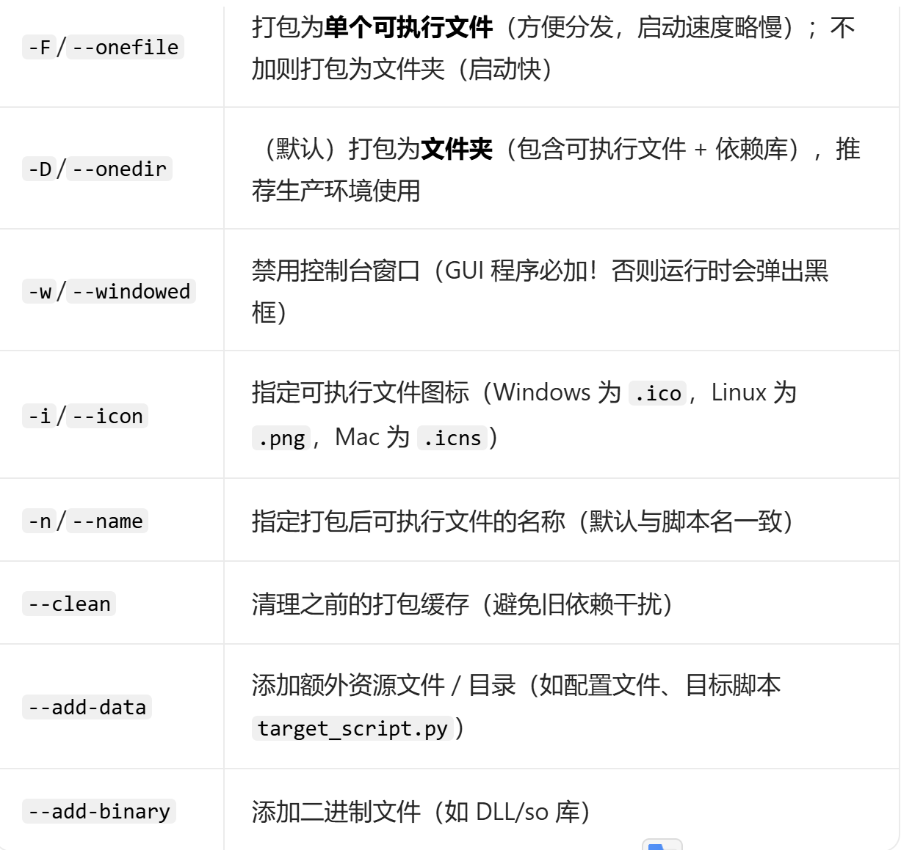

# python_ui
基于python实现页面功能

可以实现通过页面直接调用对应的脚本程序

PyQt5实现页面
Qt Designer 可视化开发：
运行 designer.exe（Windows）/ designer（Linux）打开可视化编辑器，拖拽控件生成 .ui 文件；
通过 pyuic5 -x ui_file.ui -o ui_file.py 将 .ui 文件转为 Python 代码，直接集成到项目中，无需手写布局。

打包为可执行文件：用 PyInstaller 将代码打包为 exe（Windows）/app（Mac）/ 可执行文件（Linux），
无需安装 Python 环境即可运行：

pip install pyinstaller

示例
├── main.py          # 主GUI脚本
├── target_script.py # 被调用的目标脚本
├── icon.ico         # 图标文件
└── config.ini       # 配置文件（可选）

pyinstaller -F -w -i icon.ico -n "视频帧提取工具" ^
--add-data "target_script.py;." ^  # 将target_script.py打包到可执行文件同级目录
--add-data "config.ini;." ^        # 配置文件同理
main.py

